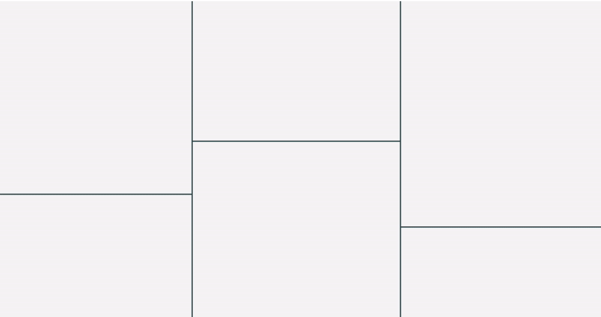
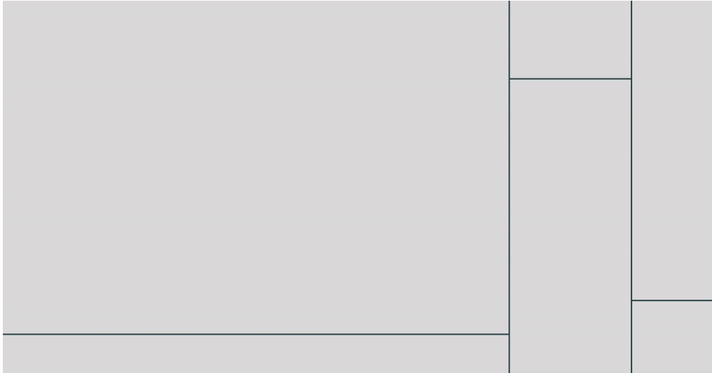
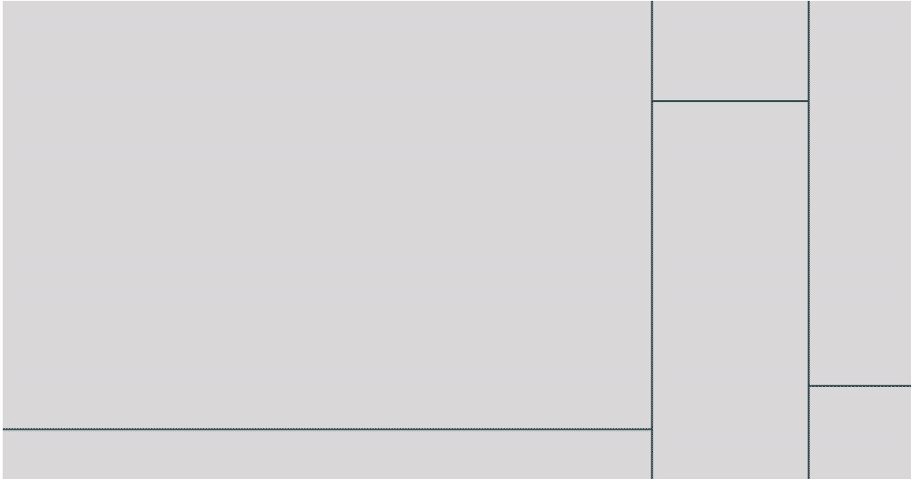
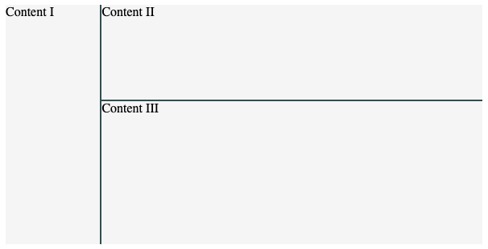

<p align="center"></p>
<p align="center"></p>

<p align="center"> A <a href="https://vuejs.org/">Vue.js</a> <a href="https://www.blender.org/"> Blender</a> <a href="https://docs.blender.org/manual/en/latest/interface/window_system/areas.html">style</a> area manager to create custom layouts.</p>

<p align="center">
  
  
</p>
<p align="center">
  
  
</p>

Areas aims to provide a flexible and customizable environment to create custom UI layouts using [Vue.js](https://vuejs.org/).

It is possible to **split** (vertical/horizontal), **resize**, **swap** and **delete** areas as needed. Current layout can be **saved** and **loaded** later. Components in areas are **cached** and not rerendered when layout is edited. Areas width and height are **percentage ratio based** so resizing the viewport will resize areas accordingly. Styles can be customized using [CSS variables](https://developer.mozilla.org/en-US/docs/Web/CSS/Using_CSS_custom_properties).

# Install

npm :

```
npm i @bimdata/areas
```

# Usage

Import Areas on your Vue.js app :

```javascript

import Areas from "@bimdata/areas";

```

Use it in your component :

```html
<template>
  <div class="yourComponent">
    <Areas :cfg="areasCfg" />
  </div>
</template>
```

Configuration example :

```javascript
const areasCfg = {
  // The available components that will be used in areas.
  components: [
    { render: h => h("div", "Content I") },
    { render: h => h("div", "Content II") },
    { render: h => h("div", "Content III") }
  ],
  // The layout divided in areas, composed by areas or area containers.
  layout: {
    // area container
    direction: "row",
    ratios: [20, 80],
    children: [
      {
        // area
        componentIndex: 0,
      },
      {
        // area container
        direction: "column",
        ratios: [40, 60],
        children: [
          {
            // area
            componentIndex: 1,
          },
          {
            // area
            componentIndex: 2
          }
        ]
      }
    ]
  }
};
```

Result :



# API

## Configuration

Areas needs an object as cfg props :

### `cfg` :
| Property | Type | Description |
| :--- | :--- | :--- |
| `components` | `array` | **Required**. An array of Vue.js components. |
| `layout` | `array` | **Required**. An [`area`](#area) or an [`area container`](#area-container). |
| `separatorThickness` | `number` | **Optional**. Default to 2. The thickness of separators. |
| `separatorDetectionMargin` | `number` | **Optional**. Default to 10. Margin of the detection region on separators. This helps user to get the separator with the mouse even if it is small. |
| `areaMinRatio` | `number` | **Optional**. Default to 0. The minimal ratio of an area. |
| `defaultComponent` | `object` | **Optional**. Default to a component that render nothing. The default component that will be used when splitting window or usin componentIndex = null. |

### `area` :
| Property | Type | Description |
| :--- | :--- | :--- |
| `componentIndex` | `number` | **Required**. A valid index of the `cfg.components` array, or null for the default component. |
| `name` | `string` | **Optional**. A name that can be used to retrieve area content. |
| `cfg` | `object` | **Optional**. A [data object](https://vuejs.org/v2/guide/render-function.html#The-Data-Object-In-Depth) used to pass props, event listener... to the component instance. |

### `area container` :
| Property | Type | Description |
| :--- | :--- | :--- |
| `ratios` | `array` | **Required**. An array of integer the represent the precentage of the corresponding children in the container. Length must be > 1. |
| `children` | `array` | **Required**. An array of [`area`](#area) or [`area container`](#area-container). Must have the same length as ratios. |
| `direction` | `string` | **Optional**. Default to `row`. Can be changed to `column`. The way areas will be displayed in the container. |

## Modes

Areas component instance can be set with *modes* :
- `split-vertical` : a vertical bar is displayed on top of hovered (active) area. Clicking will split area vertically.
- `split-horizontal` : a horizontal bar is displayed on top of hovered (active) area. Clicking will split area horizontally.
- `swap` : areas can be dragged and dropped to swap them.
- `delete` : clicking area delete it. (it is impossible to delete the last remaining area)

To set mode, use `setMode` on areas instance : (example using [ref](https://vuejs.org/v2/api/#ref))
```javascript
this.$refs.areas.setMode(mode); // mode must be "split-vertical", "split-horizontal", "swap", "delete" or null to exit modes
```

When mode is different from null, overlays will be displayed on areas. To change overlays style, use [corresponding css variables](#style).

## Public Methods

Methods on Areas instance :

| Name | Arguments | Description |
| :--- | :--- | :--- |
| `getCurrentLayout()` | none | Get the current layout. |
| `loadLayout(layout)` | `layout`: **Required**. A layout object get by calling getCurrentLayout. | Load a saved layout. |
| `changeAreaContent(areaId, contentCfg)` | `areaId`: **Required**. The id of the area to change the content. `contentCfg`: **Required**. An [`area content`](#area) object.  | Change the content of an area. |
| `setMode(mode)` | `mode`: **Required**. See [Modes](#Modes) | Change Areas mode. |
| `deleteArea(areaId)` | `areaId`: **Required**. | Delete area with this id. |
| `splitArea(areaId, way, percentage = 50, insertNewAfter = true)` | `areaId`: **Required**. `way`: **Required**. "vertical" or "horizontal". `percentage`, the percentage from left or top. `insertNewAfter`, if the new area will be inserted after or before the splitted one. | Split area. |
| `swapAreas(areaId1, areaId2)` | `areaId1` & `areaId2`: **Required** numbers | Swap areas. |
| `getAreaContentByName(name)` | `name`: **Required** string | Get [`area content`](#area) by name. |

## Style

It is possible to customize areas style by declaring css variables :

```css
/* Cursors */
--areas-delete-cursor some-valid-cursor;
--areas-vertical-resize-cursor some-valid-cursor;
--areas-horizontal-resize-cursor some-valid-cursor;
--areas-vertical-split-cursor: some-valid-cursor;
--areas-horizontal-split-cursor: some-valid-cursor;
--areas-drag-cursor some-valid-cursor;
--areas-dragging-cursor: some-valid-cursor;
--areas-delete-cursor some-valid-cursor;

/* Areas basics */
--areas-background-color: color;
--areas-separator-color: color;
--areas-split-line-color: color;

/* Areas modes overlays */
--areas-overlay-color: color;
--areas-overlay-outline-offset: outline-offset-px;
--areas-overlay-outline: css-outline-properties;

--areas-overlay-split-color: color;
--areas-overlay-split-outline-offset: outline-offset-px;
--areas-overlay-split-outline: css-outline-properties;

--areas-overlay-delete-color: color;
--areas-overlay-delete-outline-offset: outline-offset-px;
--areas-overlay-delete-outline: css-outline-properties;

--areas-overlay-swap-color: color;
--areas-overlay-swap-outline-offset: outline-offset-px;
--areas-overlay-swap-outline: css-outline-properties;

--areas-overlay-swapover-color: color;
--areas-overlay-swapover-outline-offset: outline-offset-px;
--areas-overlay-swapover-outline: css-outline-properties;
```

[css-outline-properties](https://developer.mozilla.org/en-US/docs/Web/CSS/outline)
[some-valid-cursor](https://developer.mozilla.org/en-US/docs/Web/CSS/cursor)

## Area injection

Each child component in an area will be able to get some area utilities from the area it leaves in by [injecting](https://vuejs.org/v2/guide/components-edge-cases.html#Dependency-Injection) $area :

```javascript
{
  // Your Vue.js component
  inject: ["$area"]
}
```

The `$area` object will provide the following properties :

| Property | Description |
| :--- | :--- |
| id | The id of the area. |
| domElement | The domElement of the area. |
| component | The Vue.js component instance of the area. |
| contentComponent | The Vue.js component instance of the first child of the area. (It is different from area.$children[0] due to implementation) |
| areas | The Areas Vue.js component instance. |
| onChange(handler) | A method that accepts a callback (handler) as parameter. The handler will be called when area change (swap) with newAreaId and OldAreaId as parameters. |
| offChange(handler) | A method that accepts a callback (handler) as parameter to stop listening to area change with this handler. |

# Development

Build on change for development and serve :
```
npm run dev
```

All Tests :
```
npm run test
```

Unit tests :
```
npm run build:prod
npm run test:unit
```

E2e tests :
```
npm run build:prod
npm run test:e2e
```

To e2e test on development (this will build in production mode and open cypress instead of running it) :
```
npm run test:e2e-dev
```
